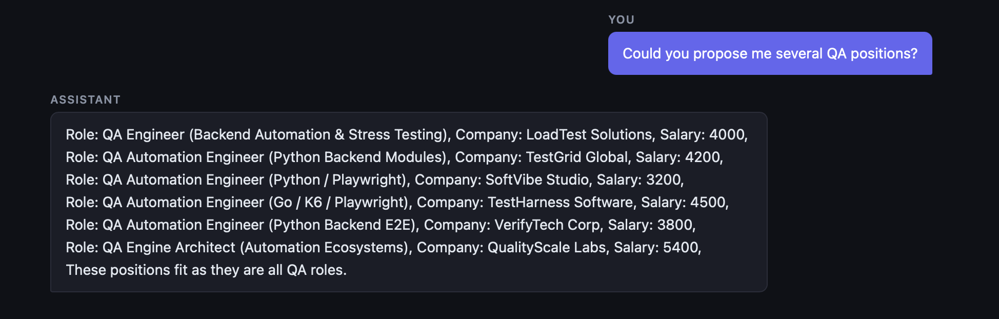
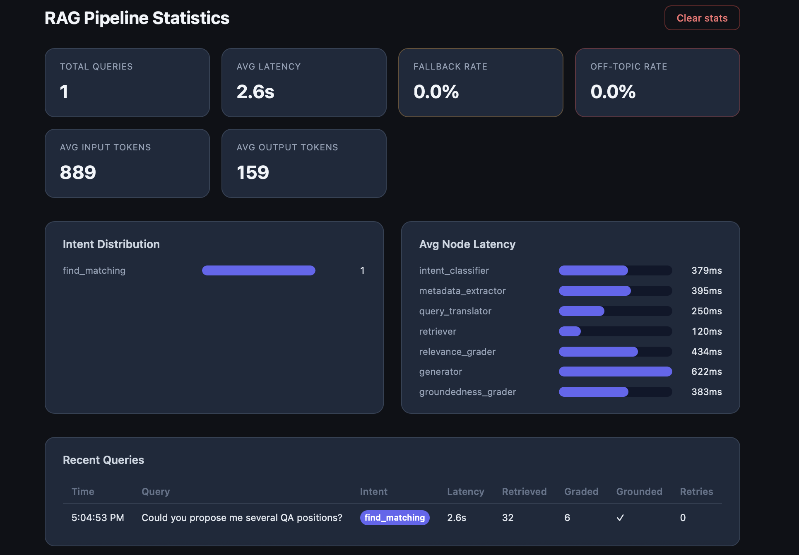

# global_hr_rag

> [!NOTE]
> **About the UI:** The frontend is a lightweight convenience layer for local demos. Please do not judge the project primarily by its interface — the focus here is the RAG pipeline, not visual polish.

A RAG system written in 2 days with AI-tools, inspired by [globalwork.ai](https://globalwork.ai), built around mock IT vacancy data from `vacancies.json` at the project root, with optional CV upload (PDF) for personalized matching. The app is a single-window, single-user chat — the emphasis is on RAG-core, not on UX.


---

## Quick start

```bash
git clone https://github.com/romashovdmitry/global_hr_rag.git
cd global_hr_rag
cp .env.example .env
```

Edit `.env` and set at least `GROQ_API_KEY` if you want fast cloud inference (recommended). Without it, the stack falls back to local Ollama (slower on CPU).

So, you should get the token on groq website, it's easy. There is token limits, that's why RAG could switch to downloaded model and become slower a lot.

I used downloaded models in development but they were too much slow and I switched to grioq without preparing of any fallback. It should be fixed in next development steos of course and any fallback strategy should be implemented.

```bash
docker compose -f docker-compose.local.yml up --build
```

After launch you should wait while models would be donwloaded. You will message like that

```bash
[ollama-init] All models ready.
```

That's the problem to fix in future too by updating docker-infrastructure. Currently backend container could be runned before models are downloaded.

| Service  | URL                          |
|----------|------------------------------|
| Chat UI  | http://localhost:5173        |
| Backend  | http://localhost:8000        |
| API docs | http://localhost:8000/docs   |
| Stats    | http://localhost:5173/stats  |

On first startup the backend bootstraps Qdrant, ingests `vacancies.json` if the collection is empty, and runs Alembic migrations automatically.

At the top there are 2 buttons to download your CV in PDF format and clear your chat history.

---

## Beyond vanilla RAG

Vanilla RAG is roughly: *embed query → retrieve top-k → paste into prompt → generate*.

This project adds a multi-stage LangGraph pipeline on top of that baseline. Here are **18 improvements** we've implemented:

### Pipeline Architecture

1. **Intent Classification**  
    We added a dedicated intent classifier (7 intents), so the pipeline understands what type of user request it receives.  
    *Solves:* "Find options", "compare", and "pick the best" are handled differently instead of one generic response pattern.

2. **Cloud Inference (Groq) with Local Fallback (Ollama)**  
    Provider auto-selects based on `GROQ_API_KEY` presence.  
    *Solves:* ~1–3 sec response time instead of ~60–120 sec on local CPU.

3. **Hybrid Search**  
    We combine semantic search and keyword search, then merge results into one ranked list.  
    *Solves:* Better coverage of both meaning and exact terms in vacancy texts.

4. **Qdrant Payload Indexes**  
    Explicit payload indexes are created on key vacancy metadata fields (`status_of_role`, `salary`).  
    *Solves:* Hard filters like format and salary work quickly and consistently.

5. **Multi-Query Retrieval by Intent**  
    For each user request, the system generates several search formulations, and the strategy depends on intent (e.g., broader for aggregate questions, role-focused for transitions).  
    *Solves:* Different query types retrieve more relevant vacancy sets.

6. **Relevance Grader (LLM-as-Judge)**  
   After retrieval, LLM filters out irrelevant vacancies. `exclude_skills` is post-filtered by text, not Qdrant index.  
    *Solves:* Final context quality before answer generation, including support for constraints like "no Django".

7. **Groundedness Grader + Retry with Feedback**  
   Verifies answers rely on retrieved vacancies. On failure, drafts are discarded, reasons logged, and passed to next generation. Retries search with different phrasings (up to N times).  
   *Solves:* Hallucinations — unsupported claims never reach the user. Model knows *why* the previous answer failed.

### Quality & Corner Cases

8. **Hard Filters from Metadata**  
    LLM extracts salary and format; retriever applies as Qdrant Filter on indexed payload fields.  
    *Solves:* "Remote only" and "from $4000" are strict conditions, not guesses.

9. **Unsupported Criteria Detection**  
    Deterministically catches criteria missing from data (country, benefits, company size) and honestly reports we can't filter on them.  
    *Solves:* Prevents hallucinated "vacancies in Europe" when location fields don't exist.

10. **Deterministic Off-Topic Refusal**  
    Off-topic questions are rejected at classification with a fixed canned response — no Qdrant search, no LLM generation.  
    *Solves:* No pipeline waste; no hallucinated answers to "how to cook borscht".

11. **Simplified IDs for Grading**  
    Vacancies are numbered `#1..#N` in grader prompts, not UUIDs.  
    *Solves:* Small models can't reliably reproduce UUIDs in structured output.

12. **Role Transition: Exclude Current Role**  
    For `role_transition` intent, current role is extracted and relevance grader explicitly removes same specialization from results.  
    *Solves:* Semantic search pulls current role when user asks to switch careers.

13. **Expanded Retrieval for Aggregate (`top_k=20`)**  
    Multi-hop questions ("which companies offer relocation + insurance?") need a wide document pool, not just top-10.  
    *Solves:* Synthesis and multi-fact statistics require broader coverage.

### Context & Memory

14. **Rolling Summarization of History**  
    Long conversations compress into a sliding summary + recent messages.  
    *Solves:* Full history doesn't fit context; dialogue essence is retained until explicit reset.

15. **CV in Context**  
    Uploaded resume (PDF → text) is added to query context; one active CV at a time.  
    *Solves:* Personalized recommendations tailored to candidate.

### Testing & Evaluation

16. **Behavioral Test Suite**  
    Each test runs the **full LangGraph pipeline** on live Qdrant and LLM, checking **answer properties** not string matching: off-topic → refusal phrase; "Python without Django" → excluded tech not in answer; aggregate → multiple companies/facts; typos and colloquial Russian → non-empty relevant response; unsupported criteria → honest limitation.  
    *Solves:* Catches regressions when prompts, models, or nodes change — not unit functions, but concrete user-facing scenarios.

17. **Golden Dataset + Ragas Metrics**  
     30+ questions (currently 34) across 9 corner-case categories. Ragas computes Faithfulness, Answer Relevancy, Context Recall, and Context Precision with quality thresholds.  
    *Solves:* Quantitative retrieval + generation scoring before release — behavioral tests show "broken/works", Ragas shows *how well*.

### Reliability & Observability

18. **Metrics & Stats Dashboard**  
    Per-query logging: latency per node, tokens, intent, fallback rate. Dedicated `/stats` dashboard.  
    *Solves:* Pipeline performance and quality visibility, bottleneck detection.

---

## Screenshots

### Chat




### Stat



---

## Stack

- **Backend:** FastAPI, LangGraph, Qdrant, PostgreSQL
- **LLM:** Groq (optional) or Ollama (local fallback)
- **Embeddings:** fastembed (`BAAI/bge-small-en-v1.5` + `Qdrant/bm25`)
- **Frontend:** React + Vite (functional demo UI)
- **Infra:** Docker Compose (`docker-compose.local.yml`)
